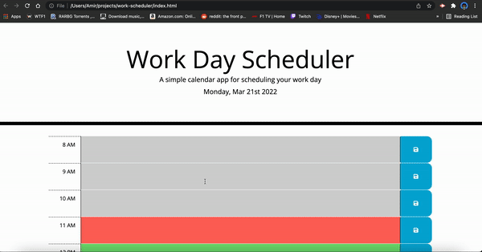

# Work Day Scheduler 

## Description
This is a basic day planner app that loops through the hours of 8am - 5pm(typical working hours) for a specific date, which is the current day that the user opens the app. The app uses moment.js to handle time. The app also allows the user to enter and save text into any description field that has a class of future. The data will be saved to the localStorage of the browser. The past hours are highlighted gray, the current hour red, and future hours green.

## Usage
* This workday calendar display work hours of the day 8AM - 5PM.
* On the top of the page, current day and date is diplayed.
* Each time block is color coded to indicate whether it occurs in the past(gray), present(red), or future(green).
* Each time block has an input field and save button where users can store their schedule.
* Once it saved, it will store in their local storage.
* This calendar is desktop and mobile compatible.

## Built With
* HTML
* CSS
* JavaScript
* jQuery
* Bootstrap

## Website URL
https://amir-hackett.github.io/work-day-scheduler/

## Mock Up

Amir Hackett ©2022